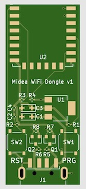
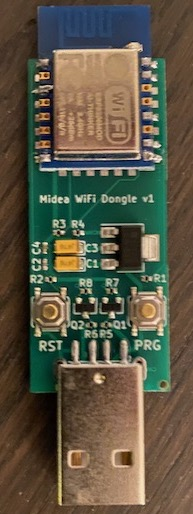
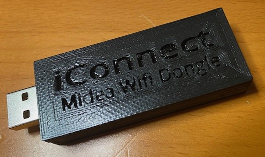

# Midea HVAC WiFi Dongle - v2 for EU-SK105

This repo is based on [Rene Klootwijk's repository](https://github.com/reneklootwijk/mideahvac-dongle). So majority of credits for all this go to him! Original ReadMe from him is also below.

I've made a couple of changes so the board, mainly to fit its size to the Midea EU-SK105 dongle that is common nowadays and to use a bit more common parts. List of changes below:
* Converted the KiCad project to KiCad 9
* Size of the PCB **without a case** is now exactly the size of the EU-SK105 **with a case**, which is 41x24mm. That means you can use it as 1:1 drop-in replacement.
* All pads are now "hand-solder" pads to allow for easier hand soldering, if you wish to
* The footpronts for the LDO caps are now 0805 hand solder pads, compared to the larger pads they were before. This allows you to use usual ceramic caps, if you wish to (which are totally fine to use here), instead of the recommended tantalum caps. You can still use tantalum caps, if you wish so, as they also come in 0805 package size.
* Replaced a few resistors with a single resistor array. While this is not a common part people have at home, it saves space and is just less parts on the board
* Added iBOM file which is a great soldering help. Give it a look!
* Gerbers, BOM and CPL files have also of course been updated

Additional hint which also applies to Rene's original version: You can also use and ESP-07 instead which offers and external antenna, just in case you need better Wi-Fi reception ;)

That's what the board now looks like:

*(Original ReadMe below)*

---

This repository contains the hardware design of a WiFi dongle for Midea-like airconditioners and humidifiers.
Midea provides a WiFi dongle (SK102/SK103), either as optional feature or built-in, to control the appliances via a mobile application. This dongle uses and is dependent on the Midea cloud which does not expose a publically available API. The protocol used by the dongle has been reverse engineered, but newer version still require the cloud to obtain an encryption key or require an addition server simulating the Midea cloud. This means integration in an existing home automation system is not straight forward.

Besides the protocol the dongle uses to commumicate with the mobile app and the cloud, also the protocol that is used between the dongle and the appliances has been reverse engineered (at least the most important parts). This means the original dongle can be replaced by a custom dongle making it independent on any cloud.

Besides Midea itself other vendors of these type of appliances are also using the Midea cloud and dongle to support control via a mobile app. Examples of these vendors are:

* Qlima
* Artel
* Carrier
* Toshiba
* Idema

This design of a custom dongle can be used to replace the orignal dongle with a type A USB connector. The version with with a JST-XH connector needs a slight modification.

## Technical design

The design of the dongle is based on an ESP-12 which provides the WiFi interface and microcontroller to communicate with the appliance. Because the interface of the appliance is a 5V TTL serial port (UART) and the ESP-12 uses 3.3V and is not 5V tolerant, we need level shifters for the communication and a power regulator in order to power the dongle from the appliance.

The design has been made in KiCad and all files can be found in the KiCad directory.

   
  <em>The KiCad PCB design</em>

Note: The resulting PCB including the ESP-12 turned out to be 1 mm to long to fit into the location of the original dongle (in my Artel airconditioner). It was easy to locate it somewhere else, but pay attention whether the PCB would fit in your appliance. The dimensions of the dongle are: 55mmx20mm (l*w) without casing.

## Ordering and manufacturing

The PCB can be ordered by the manufacturer of your choosing. I had it manufactured and partly assembled by [JLCPCB](https://jlcpcb.com/). The files required to order the PCB including the SMT assembly of all components except the ESP-12 and USB connector can be found in the JLCPCB directory.

   
  <em>The assembled PCB</em>

The JLCPCB directory contains the following files:

* Gerber-Midea WiFi Dongle v1.zip, this zip contains all gerber files and the drill file.
* BOM-Midea WiFi Dongle.csv, this is the Bill Of Material file.
* CPL-Midea WiFi Dongle.csv, this is the Pick and Place file

Note: The ESP-12 and USB connector are not part of the BOM and need to be ordered somewhere else, JLCPCB could not deliver them. This also means you have to solder them yourself.

## Case

I also designed a case that can printed on a 3d printer. The .STL file is part of this repository.

   
  <em>The 3D printed case</em>

## Firmware

At this moment there are several options:
* Sören Beye created firmware to integrate dehumidifiers with Home Assistant: https://github.com/Hypfer/esp8266-midea-dehumidifier.
* Sergey V. Dudanov created an extension for ESPHome integrating aircondititioners with Home Assistant: https://github.com/dudanov/esphome.
* I created a node.js module to integrate airconditioners with anything you like, but you need to program: https://github.com/reneklootwijk/node-mideahvac. The firmware required on the dongle is esplink, a serial bridge: https://github.com/jeelabs/esp-link.
* To reverse engineer the protocol the original dongle is using to communicate with your appliance, you can use this custom dongle to capture this communication. See https://github.com/reneklootwijk/midea-uartsniffer.